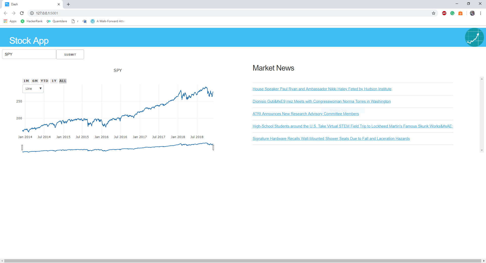

# Dash-Stock-App
https://github.com/fdupuis659/Dash-Stock-App/
https://www.youtube.com/watch?v=tpkZqE_cJsE

Simple dash application to demonstrate integrating core components and http requests. This is the project made in conjunction with my [Dash tutorial series](https://www.youtube.com/watch?v=Ldp3RmUxtOQ&list=PLCDERj-IUIFCaELQ2i7AwgD2M6Xvc4Slf) on YouTube.



# Contents
* ```app.py``` - Front and back end portion of the web application excluding css and static data
* ```Assets Folder```  - css files and static images

# Installation
* Download the entire repository as a folder and open ```app.py``` and run it with idle or another IDE of your choice for python. That's it!
